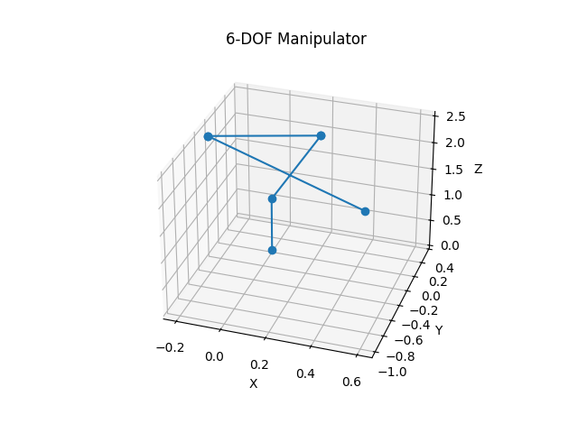

# Lab 1 — Forward Kinematics of a 6-DOF Robotic Manipulator using the Denavit-Hartenberg Convention


 


> **Course:** Robot Modeling and Identification (RMI) <br>
> **Author:** Umer Ahmed Baig Mughal — MSc Robotics and Artificial Intelligence <br>
> **Topic:** Forward Kinematics · Homogeneous Transformation Matrices · DH Parameters · Euler Angle Extraction · 3D Kinematic Chain Visualization

---

## Table of Contents

1. [Objective](#objective)
2. [Theoretical Background](#theoretical-background)
   - [Denavit-Hartenberg Convention](#denavit-hartenberg-convention)
   - [Homogeneous Transformation Matrix](#homogeneous-transformation-matrix)
   - [Forward Kinematics Chain](#forward-kinematics-chain)
   - [Euler Angle Extraction](#euler-angle-extraction)
3. [Robot Configuration](#robot-configuration)
   - [DH Parameter Table](#dh-parameter-table)
   - [Joint Offset Vector](#joint-offset-vector)
4. [Implementation](#implementation)
   - [File Structure](#file-structure)
   - [Function Reference](#function-reference)
   - [Code Walkthrough](#code-walkthrough)
5. [3D Visualization](#3d-visualization)
   - [How the Visualization Works](#how-the-visualization-works)
   - [Visualization Walkthrough](#visualization-walkthrough)
   - [Interpreting the Plot](#interpreting-the-plot)
6. [How to Run](#how-to-run)
7. [Results](#results)
8. [Dependencies](#dependencies)
9. [Notes and Limitations](#notes-and-limitations)
10. [Author](#author)
11. [License](#license)

---

## Objective

This lab implements the **forward kinematics** of a six-degree-of-freedom (6-DOF) serial robotic manipulator from scratch using the classical **Denavit-Hartenberg (DH) parameterisation**. Given a set of joint angles, the algorithm computes the **position and orientation** (pose) of the end-effector with respect to the base frame. The lab is further extended with an **interactive 3D visualization** of the full kinematic chain, rendering each joint frame origin and the connecting links in three-dimensional space.

The key learning outcomes are:

- Constructing the per-joint 4×4 homogeneous transformation matrix from four DH parameters.
- Composing the full kinematic chain via sequential matrix multiplication.
- Extracting the end-effector Cartesian position and ZYZ-style Euler angles from the resulting transformation, including correct handling of kinematic singularities.
- Accumulating and storing intermediate frame transformations to reconstruct the spatial layout of all robot links.
- Rendering a fully labelled 3D matplotlib plot of the manipulator configuration.

---

## Theoretical Background

### Denavit-Hartenberg Convention

The Denavit-Hartenberg (DH) convention (Denavit & Hartenberg, 1955) provides a systematic and minimal parameterisation of the geometry of a serial kinematic chain. Each link–joint pair is fully described by exactly **four scalar parameters**:

| Parameter | Symbol | Definition |
|-----------|--------|------------|
| Joint angle | θᵢ | Rotation about the **zᵢ₋₁** axis, bringing **xᵢ₋₁** into alignment with **xᵢ** |
| Link offset | dᵢ | Translation along the **zᵢ₋₁** axis to the common perpendicular |
| Link length | aᵢ | Length of the common perpendicular (translation along **xᵢ**) |
| Twist angle | αᵢ | Rotation about **xᵢ** aligning **zᵢ₋₁** with **zᵢ** |

For a revolute joint (as used here), **θᵢ** is the variable quantity; `d`, `a`, and `α` are fixed geometric constants of the mechanism.

---

### Homogeneous Transformation Matrix

The transformation from frame *i−1* to frame *i* is encoded in the 4×4 matrix:

```
        ┌  cos θᵢ   -sin θᵢ cos αᵢ    sin θᵢ sin αᵢ   aᵢ cos θᵢ ┐
ᵢ⁻¹Tᵢ = │  sin θᵢ    cos θᵢ cos αᵢ   -cos θᵢ sin αᵢ   aᵢ sin θᵢ │
        │  0          sin αᵢ            cos αᵢ           dᵢ     │
        └  0          0                 0                1      ┘
```

This matrix encapsulates both the **rotation** (upper-left 3×3 block) and the **translation** (right-most column) that relate two consecutive coordinate frames.

---

### Forward Kinematics Chain

The end-effector pose relative to the base frame is obtained by the ordered product of all individual link transformation matrices:

```
⁰T₆  =  ⁰T₁ · ¹T₂ · ²T₃ · ³T₄ · ⁴T₅ · ⁵T₆
```

The resulting 4×4 matrix has the form:

```
⁰T₆ = ┌ R₃ₓ₃  |  p₃ₓ₁ ┐
       └  0 0 0 |   1   ┘
```

where **R** is the 3×3 rotation matrix of the end-effector frame and **p = [x, y, z]ᵀ** is its Cartesian position.

---

### Euler Angle Extraction

The orientation of the end-effector is expressed as **ZYZ Euler angles** (φ, θ, ψ) extracted analytically from **R**. Three cases are handled to avoid numerical issues near kinematic singularities:

**General case** `|R[2,2]| < 1` (non-singular):
```
φ = atan2( R[1,2],  R[0,2] )
θ = atan2( √(1 − R[2,2]²),  R[2,2] )
ψ = atan2( R[2,1], −R[2,0] )
```

**Degenerate case** `R[2,2] = +1` (θ = 0, axes aligned):
```
φ = 0,   θ = 0,   ψ = atan2( R[1,0], R[0,0] )
```

**Degenerate case** `R[2,2] ≠ +1 and |R[2,2]| ≥ 1` (θ = π):
```
φ = atan2( −R[0,1], −R[0,0] ),   θ = π,   ψ = 0
```

---

## Robot Configuration

### DH Parameter Table

The manipulator modelled in this lab is a **6-DOF revolute-joint serial chain** whose fixed geometric parameters are defined as follows:

| Joint | θᵢ (variable, rad) | dᵢ (m) | aᵢ (m) | αᵢ (rad)  |
|:-----:|:-------------------:|:-------:|:-------:|:---------:|
|   1   | q₁ + 0              | 1       | 0       | +π/2      |
|   2   | q₂ + 0              | 0       | 1       |  0        |
|   3   | q₃ + **π/2**        | 0       | 0       | +π/2      |
|   4   | q₄ + 0              | 1       | 0       | −π/2      |
|   5   | q₅ + 0              | 0       | 0       | +π/2      |
|   6   | q₆ + 0              | 1       | 0       |  0        |

> The structural pattern (alternating ±π/2 twists, non-zero offsets at joints 1, 4, and 6, and a single prismatic-like link at joint 2) is consistent with a **PUMA-class** or similar elbow-type industrial manipulator.

### Joint Offset Vector

A constant joint offset vector **q₀** is added to the commanded joint angles before any computation to account for the mechanical zero-position of the robot:

```
q₀ = [0,  0,  π/2,  0,  0,  0]  (rad)
```

This shifts joint 3 by 90° to align the kinematic model with the physical robot's reference configuration.

---

## Implementation

### File Structure

```
Lab_1/
└── RMI_Task_1.py       # Forward kinematics + 3D kinematic chain visualization
├── Results/
│   └── lab1_robot.png
```

### Function Reference

#### `ht(theta, d, a, alpha) → np.ndarray`

Constructs and returns the **4×4 Denavit-Hartenberg homogeneous transformation matrix** for a single revolute joint.

| Argument | Type    | Unit | Description                              |
|----------|---------|------|------------------------------------------|
| `theta`  | `float` | rad  | Joint angle (rotation about z-axis)      |
| `d`      | `float` | m    | Link offset (translation along z-axis)   |
| `a`      | `float` | m    | Link length (translation along x-axis)   |
| `alpha`  | `float` | rad  | Twist angle (rotation about x-axis)      |

**Returns:** `np.ndarray` of shape `(4, 4)` — the transformation matrix ᵢ⁻¹Tᵢ.

---

#### `forward_kinematics(joint_angles, a, d, alpha) → list`

Computes the **complete forward kinematics** of the 6-DOF manipulator.

| Argument       | Type            | Description                                      |
|----------------|-----------------|--------------------------------------------------|
| `joint_angles` | `list[float]`   | Six joint angles in radians (before offset)      |
| `a`            | `list[float]`   | Link length vector (length = 6)                  |
| `d`            | `list[float]`   | Link offset vector (length = 6)                  |
| `alpha`        | `list[float]`   | Twist angle vector (length = 6)                  |

**Returns:** `list` — `[x, y, z, φ, θ, ψ]` (all values in metres / radians, rounded to 2 decimal places).

**Raises:** `ValueError` if the lengths of `joint_angles`, `a`, `d`, and `alpha` do not all match.

---

#### `forward_kinematics_with_frames(joint_angles, a, d, alpha) → list[np.ndarray]`

An extended variant of `forward_kinematics` that, instead of returning only the final end-effector pose, returns **all intermediate 4×4 transformation matrices** — one for the base frame and one for each joint frame up to and including the end-effector. This provides the spatial coordinates of every joint origin, which are required for visualization.

| Argument       | Type            | Description                                      |
|----------------|-----------------|--------------------------------------------------|
| `joint_angles` | `list[float]`   | Six joint angles in radians (before offset)      |
| `a`            | `list[float]`   | Link length vector (length = 6)                  |
| `d`            | `list[float]`   | Link offset vector (length = 6)                  |
| `alpha`        | `list[float]`   | Twist angle vector (length = 6)                  |

**Returns:** `list` of seven `np.ndarray` objects of shape `(4, 4)`, ordered from the **base frame** (identity) through to **frame 6** (end-effector).

> ⚠️ **Important — Coincident Frames:** Although 7 matrices are always computed and stored, **only 5 geometrically distinct positions** are produced for this robot configuration. Joints 3 and 5 both have `a = 0` and `d = 0` in the DH table, meaning they introduce a pure rotation with no translational component. Their frame origins therefore coincide exactly with the preceding frame:
> - **Frame 3 ≡ Frame 2** → `(0.1644, 0.3229, 1.9320)` m
> - **Frame 5 ≡ Frame 4** → `(−0.1990, −0.3910, 2.5305)` m
>
> This is geometrically correct behaviour — not a bug — and is reflected in the plot showing **5 visible markers** rather than 7.

**Key distinction from `forward_kinematics`:** At each iteration the cumulative matrix `T` is deep-copied (via `.copy()`) and appended to the `frames` list *before* the function returns, preserving the intermediate state of the kinematic chain at every joint.

---

#### `plot_robot(frames) → None`

Renders the kinematic chain of the manipulator as a **3D line-and-marker plot** using Matplotlib.

| Argument  | Type              | Description                                                           |
|-----------|-------------------|-----------------------------------------------------------------------|
| `frames`  | `list[np.ndarray]`| Seven 4×4 transformation matrices from `forward_kinematics_with_frames` |

The function extracts the **translational component** (column 4, rows 1–3) from each frame matrix to obtain the `(x, y, z)` position of each joint origin in the base frame. These seven points are then connected sequentially, forming the visual skeleton of the robot. Each joint position is marked with a circular node (`marker='o'`).

**Returns:** `None` — displays the interactive 3D Matplotlib figure.

### Code Walkthrough

```python
# Step 1 — Apply mechanical zero-offset to joint angles
q0 = np.array([0, 0, np.pi/2, 0, 0, 0])
joint_angles = np.array(joint_angles) + q0

# Step 2 — Initialise the cumulative transformation as the identity
T = np.eye(4)

# Step 3 — Compose individual joint transformations sequentially
for i in range(n):
    T_i = ht(joint_angles[i], d[i], a[i], alpha[i])
    T = T @ T_i          # Left-to-right matrix product builds ⁰T₆

# Step 4 — Extract position from the last column of ⁰T₆
x, y, z = T[:3, 3]

# Step 5 — Extract rotation matrix and compute Euler angles
R = T[:3, :3]
# ... singularity-aware atan2 computations
```

---

## 3D Visualization

### How the Visualization Works

The visualization pipeline extends the core forward kinematics algorithm by capturing and preserving the **complete spatial trajectory** of all seven coordinate frames (base + 6 joints) as the kinematic chain is assembled. Rather than discarding intermediate transformation results, `forward_kinematics_with_frames` stores a snapshot of the cumulative transformation matrix after each joint multiplication.

The key insight is that **column 4 (the translation vector) of each 4×4 transformation matrix encodes the position of that joint's origin** in the base coordinate frame. Extracting these seven position vectors and connecting them in sequence produces a geometrically accurate skeleton of the robot arm.

```
Frame 0 (Base)  →  Frame 1 (Joint 1)  →  Frame 2 (Joint 2)  →  ...  →  Frame 6 (End-Effector)
     ↓                    ↓                      ↓                              ↓
  [0,0,0]            T₁[:3,3]               T₁₂[:3,3]                    T₁₂₃₄₅₆[:3,3]
```

### Visualization Walkthrough

```python
# Step 1 — Generate all 7 intermediate frame matrices (base + 6 joints)
frames = forward_kinematics_with_frames(joint_angles, a, d, alpha)
# frames[0] = identity (base)           → (0.000,  0.000, 0.000)
# frames[1] = ⁰T₁                       → (0.000,  0.000, 1.000)
# frames[2] = ⁰T₁·¹T₂                   → (0.164,  0.323, 1.932)
# frames[3] = ⁰T₁·¹T₂·²T₃  ← COINCIDENT with frames[2] (a₃=0, d₃=0)
# frames[4] = ...·³T₄                   → (-0.199, -0.391, 2.531)
# frames[5] = ...·⁴T₅       ← COINCIDENT with frames[4] (a₅=0, d₅=0)
# frames[6] = ...·⁵T₆  (end-effector)   → (0.605, -0.978, 2.437)

# Step 2 — Extract joint origin positions from the 4th column of each matrix
xs = [T[0, 3] for T in frames]   # X coordinates of all joint origins
ys = [T[1, 3] for T in frames]   # Y coordinates
zs = [T[2, 3] for T in frames]   # Z coordinates
# Result: 7 values per axis, but only 5 unique positions — overlapping
# pairs (frames 2&3, frames 4&5) render as single markers in the plot

# Step 3 — Plot the kinematic chain as a connected 3D polyline
ax.plot(xs, ys, zs, marker='o')  # Lines = links, circles = joint origins
```

### Example Output




### Interpreting the Plot

| Visual Element | Meaning |
|----------------|---------|
| **Circular markers `●`** | Joint frame origins — **5 visible** (7 computed; frames 3 & 5 overlap with frames 2 & 4 due to zero translation at those joints) |
| **Connecting lines** | Robot links — the physical segments between consecutive joint origins |
| **First marker** | Base frame origin, always at `(0, 0, 0)` |
| **Last marker** | End-effector position — corresponds to `(x, y, z)` from `forward_kinematics` |
| **Topmost markers** | Frames 4 & 5 (coincident) at `(−0.199, −0.391, 2.531)` — the highest Z in the chain |
| **Axes (X, Y, Z)** | Base coordinate frame directions |

**Computed positions of all 5 distinct visible points:**

| Visible Point | Frames | X (m) | Y (m) | Z (m) |
|:---:|:---:|:---:|:---:|:---:|
| 1 | Frame 0 (Base) | 0.000 | 0.000 | 0.000 |
| 2 | Frame 1 | 0.000 | 0.000 | 1.000 |
| 3 | Frames 2 & 3 (coincident) | 0.164 | 0.323 | 1.932 |
| 4 | Frames 4 & 5 (coincident) | −0.199 | −0.391 | 2.531 |
| 5 | Frame 6 (End-Effector) | **0.605** | **−0.978** | **2.437** |

For the test configuration `[1.1, 1.2, 1.3, 1.4, 1.5, 1.7]` rad, the end-effector (last marker, lower-right in the 3D view) is located at `(0.61, −0.98, 2.44)` m — its apparent screen position appears low due to `Y = −0.98` m pulling it deep into the 3D perspective, while its true Z height of `2.44` m is consistent with the plot's Z-axis scale (0–2.5).

---

## How to Run

### Clone the repository and navigate to the lab directory:

```bash
git clone [https://github.com/umerahmedbaig7/Robot-Modeling-and-Identification.git]
cd Robot-Modeling-and-Identification/Lab1
```

### Prerequisites

Ensure Python 3.8+ and all required packages are installed:

```bash
pip install numpy matplotlib
```

### Running the Script

```bash
python RMI_Task_1.py
```

The script will first print the numerical end-effector pose to the terminal, then open an **interactive 3D Matplotlib window** showing the full kinematic chain. The plot can be rotated, panned, and zoomed using the mouse.

### Modifying Joint Angles

To evaluate the kinematics at a different robot configuration, edit the `joint_angles` list (values in **radians**):

```python
# Example: all joints at zero (home configuration)
joint_angles = [0.0, 0.0, 0.0, 0.0, 0.0, 0.0]
```

### Changing the Robot Geometry

The DH parameters `a`, `d`, and `alpha` can be updated to model any 6-DOF serial manipulator following the standard DH convention:

```python
a     = [0, 1, 0, 0, 0, 0]                             # Link lengths (m)
d     = [1, 0, 0, 1, 0, 1]                             # Link offsets (m)
alpha = [np.pi/2, 0, np.pi/2, -np.pi/2, np.pi/2, 0]   # Twist angles (rad)
```

---

## Results

For the test configuration defined in the script:

```
Joint angles (before offset):  [1.1, 1.2, 1.3, 1.4, 1.5, 1.7]  rad
Joint offset q₀:               [0,   0,   π/2, 0,   0,   0  ]  rad
Effective joint angles:        [1.1, 1.2, 2.871, 1.4, 1.5, 1.7]  rad
```

**End-Effector Pose:**

| Parameter | Symbol | Value  | Unit |
|-----------|--------|--------|------|
| X position | x | **0.61** | m |
| Y position | y | **−0.98** | m |
| Z position | z | **2.44** | m |
| Roll (ZYZ) | φ | **−0.63** | rad |
| Pitch (ZYZ) | θ | **1.66** | rad |
| Yaw (ZYZ) | ψ | **2.62** | rad |

```
End-Effector Pose (x, y, z, phi, theta, psi):
[0.61, -0.98, 2.44, -0.63, 1.66, 2.62]
```

---

## Dependencies

| Package | Version | Purpose |
|---------|---------|---------|
| `Python` | ≥ 3.8  | Runtime environment |
| `Numpy` | ≥ 1.21  | Matrix operations, DH transformations, trigonometric functions |
| `Matplotlib` | ≥ 3.4 | 3D kinematic chain visualization (`mpl_toolkits.mplot3d`) |

Both packages are available via pip and are standard in any scientific Python environment (Anaconda, conda-forge, etc.).

---

## Notes and Limitations

- **Units:** All angular values are in **radians**; all linear values are in the same unit as the DH `a` and `d` parameters (assumed **metres** here).
- **DH Convention:** The implementation follows the **standard (classic) DH** convention, not the modified (Craig) variant. These differ in the order of the four elementary transformations and produce different matrix forms for the same robot.
- **Joint type:** All six joints are treated as **revolute**. Extending to prismatic joints would require making `d` the variable parameter for the relevant joint(s).
- **Singularity handling:** The three-branch Euler extraction guards against the two canonical singularity postures (θ = 0 and θ = π). Configurations near these postures may still exhibit reduced numerical accuracy due to finite floating-point precision.
- **No collision or joint-limit checking** is performed; the function will return a pose for any input regardless of physical reachability.
- **Visualization scope:** The plot renders only joint origin positions connected by straight lines. It does not visualize link cross-sections, coordinate frame axes (x/y/z triads), or end-effector orientation. Axis triad rendering can be added by extracting and plotting the column vectors of each frame's rotation matrix as arrows using `ax.quiver`.
- **Plot interactivity:** The Matplotlib 3D window supports mouse-driven rotation and zoom. For richer interactivity (animated configuration sweep, real-time joint-angle sliders), consider integrating `matplotlib.widgets.Slider` or migrating to a dedicated robotics visualization library such as `roboticstoolbox-python` or `PyBullet`.

---

## Author

**Umer Ahmed Baig Mughal** <br>
Master's in Robotics and Artificial Intelligence <br>
*Specialization:  Machine Learning · Computer Vision · Human-Robot Interaction · Autonomous Systems · Robotic Motion Control*

---

## License

This project is intended for **academic and research use**. It was developed as part of the *Robot Modeling and Identification* course within the MSc Robotics and Artificial Intelligence program. Redistribution, modification, and use in derivative academic work are permitted with appropriate attribution to the original author.

---

*Lab 1 — Robot Modeling and Identification | MSc Robotics and Artificial Intelligence*

