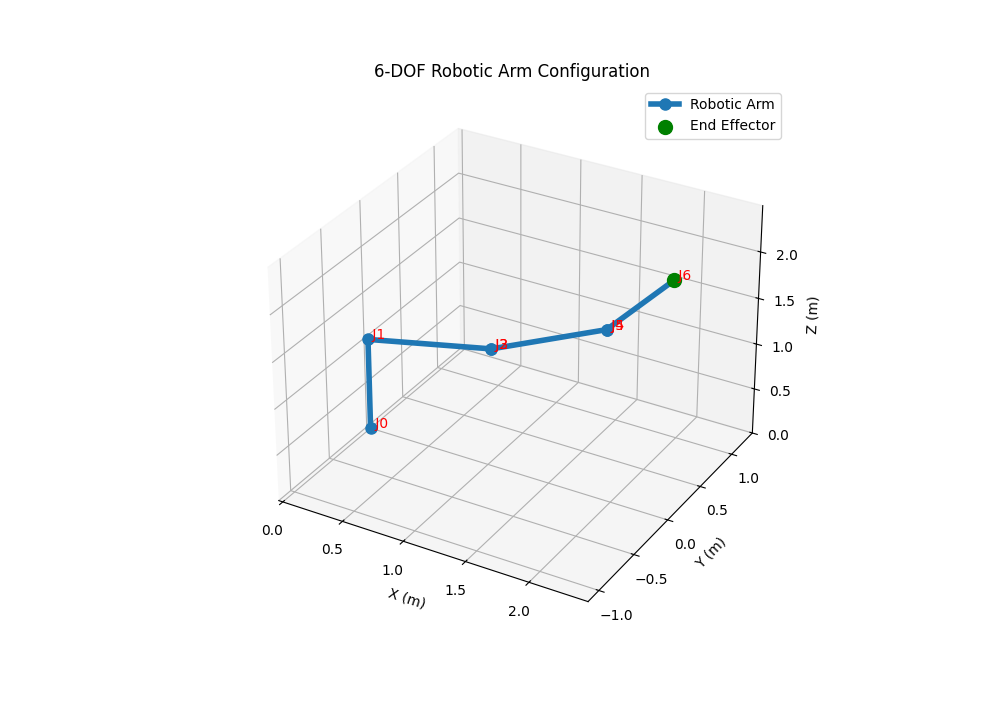

# Lab 2 — Inverse Kinematics of a 6-DOF Robotic Manipulator Using Geometric Decomposition


> **Course:** Robot Modeling and Identification (RMI) <br>
> **Author:** Umer Ahmed Baig Mughal — MSc Robotics and Artificial Intelligence <br>
> **Topic:** Inverse Kinematics · Wrist Centre Decoupling · Geometric Solution · ZYZ Euler Orientation · 3D Configuration Visualization

---

## Table of Contents

1. [Objective](#objective)
2. [Theoretical Background](#theoretical-background)
   - [Inverse Kinematics Problem](#inverse-kinematics-problem)
   - [Kinematic Decoupling — Wrist Centre Separation](#kinematic-decoupling--wrist-centre-separation)
   - [Stage 1 — Geometric Solution for q₁, q₂, q₃](#stage-1--geometric-solution-for-q₁-q₂-q₃)
   - [Stage 2 — Algebraic Solution for q₄, q₅, q₆](#stage-2--algebraic-solution-for-q₄-q₅-q₆)
   - [End-Effector Rotation Matrix from ZYZ Euler Angles](#end-effector-rotation-matrix-from-zyz-euler-angles)
   - [Numerical Robustness — Special-Case Handling](#numerical-robustness--special-case-handling)
3. [Robot Configuration](#robot-configuration)
   - [DH Parameter Table](#dh-parameter-table)
4. [Implementation](#implementation)
   - [File Structure](#file-structure)
   - [Function Reference](#function-reference)
   - [Algorithm Walkthrough](#algorithm-walkthrough)
5. [3D Visualization](#3d-visualization)
   - [How the Visualization Works](#how-the-visualization-works)
   - [Interpreting the Plot](#interpreting-the-plot)
6. [How to Run](#how-to-run)
7. [Results](#results)
8. [Verification — Round-Trip FK Check](#verification--round-trip-fk-check)
9. [Dependencies](#dependencies)
10. [Notes and Limitations](#notes-and-limitations)
11. [Author](#author)
12. [License](#license)

---

## Objective

This lab solves the **inverse kinematics (IK)** problem for a six-degree-of-freedom (6-DOF) serial robotic manipulator — the mathematical inverse of Lab 1. Given a desired end-effector **position and orientation** (pose) expressed as `[x, y, z, φ, θ, ψ]`, the algorithm computes the six joint angles `[q₁, q₂, q₃, q₄, q₅, q₆]` that realise that pose.

The solution exploits the **kinematic decoupling** property of spherical-wrist manipulators, splitting the 6-DOF problem into two tractable sub-problems: a **geometric position problem** for the first three joints and an **algebraic orientation problem** for the wrist joints. The computed configuration is then rendered as a labelled, colour-coded 3D visualization.

The key learning outcomes are:

- Understanding the kinematic decoupling principle and its applicability conditions.
- Deriving the wrist centre position from the desired end-effector pose and the distal link offset.
- Applying the law of cosines and two-argument arctangent to solve the planar arm geometry for q₁, q₂, and q₃.
- Isolating the wrist rotation matrix R₃₆ and extracting q₄, q₅, q₆ via ZYZ Euler decomposition.
- Handling kinematic singularities robustly in both position and orientation sub-problems.
- Implementing floating-point clean-up for critical angular values (±π/2) to prevent numerical drift.
- Verifying the IK solution by forward-kinematics round-trip confirmation.

---

## Theoretical Background

### Inverse Kinematics Problem

Forward kinematics maps **joint space → task space**:

```
FK:   q = [q₁ … q₆]  →  ξ = [x, y, z, φ, θ, ψ]
```

Inverse kinematics solves the reverse mapping:

```
IK:   ξ = [x, y, z, φ, θ, ψ]  →  q = [q₁ … q₆]
```

Unlike forward kinematics — which always yields a unique result — the inverse problem is generally **non-linear** and may admit **multiple solutions**, **no solution** (target unreachable), or a **continuum of solutions** (at singularities). The analytic (closed-form) approach used here exploits the robot's geometry to derive exact expressions rather than iterating numerically.

---

### Kinematic Decoupling — Wrist Centre Separation

For manipulators with a **spherical wrist** (three revolute axes intersecting at a common point), the 6-DOF IK problem separates cleanly into two independent 3-DOF sub-problems. This is the **Pieper decoupling principle**.

The **wrist centre** `p_04` — the intersection point of the three wrist axes — is located by stepping back from the end-effector along the tool's approach axis (the z-column of R₀₆) by a distance equal to the distal link offset `d₆`:

```
p_04 = p_06 − d₆ · (R₀₆ · ẑ)
```

where:
- `p_06 = [x, y, z]ᵀ` is the desired end-effector position
- `R₀₆` is the desired end-effector rotation matrix
- `ẑ = [0, 0, 1]ᵀ` is the unit vector along the z-axis of the tool frame
- `d₆ = 1` m (the offset of joint 6 in this robot's DH table)

Once `p_04 = [xc, yc, zc]` is known, joints 1–3 are solved purely from position geometry, and joints 4–6 are solved purely from orientation algebra.

---

### Stage 1 — Geometric Solution for q₁, q₂, q₃

**Joint 1 — Base rotation (q₁):**

The base joint rotates the arm to bring the wrist centre into the arm's working plane. Projecting the wrist centre onto the XY plane:

```
q₁ = atan2(yc, xc)
```

**Joint 3 — Elbow angle (q₃):**

The arm's first two links and the wrist-centre distance form a triangle. Applying the **law of cosines**:

```
cos(q₃) = (r₁² + r₂ − a₂² − d₄²) / (2 · a₂ · d₄)
```

where:
- `r₁ = zc − d₁`  (height of wrist centre above base plane)
- `r₂ = xc² + yc²`  (squared horizontal distance to wrist centre)
- `a₂ = 1` m (link 2 length), `d₄ = 1` m (link 4 offset)

```
q₃ = atan2(√(1 − cos²(q₃)),  cos(q₃))       [elbow-up solution]
```

Three branches are evaluated to handle boundary cases:
- `cos(q₃) ≈ +1`: arm fully extended, q₃ = 0
- `cos(q₃) ≈ −1`: arm fully folded, q₃ = π
- `|cos(q₃)| < 1`: general case, use atan2

**Joint 2 — Shoulder angle (q₂):**

With q₃ known, q₂ is solved from the remaining planar geometry:

```
q₂ = atan2(r₁, √r₂) − atan2(d₄ · sin(q₃),  a₂ + d₄ · cos(q₃))
```

---

### Stage 2 — Algebraic Solution for q₄, q₅, q₆

Given q₁, q₂, q₃ the cumulative transformation `T₀₃` is computed (incorporating the joint-3 offset of +π/2):

```
T₀₃ = T₀₁(q₁) · T₁₂(q₂) · T₂₃(q₃ + π/2)
```

The wrist rotation matrix is then isolated:

```
R₃₆ = R₀₃ᵀ · R₀₆
```

This gives the rotation that the three wrist joints must collectively produce. A **ZYZ Euler decomposition** on R₃₆ extracts q₄, q₅, q₆ with the same three-branch singularity handling used in Lab 1:

| Case | Condition | Solution |
|------|-----------|---------|
| General | `\|R₃₆[2,2]\| < 1` | q₄ = atan2(R₃₆[1,2], R₃₆[0,2]) · q₅ = atan2(√(1−R₃₆[2,2]²), R₃₆[2,2]) · q₆ = atan2(R₃₆[2,1], −R₃₆[2,0]) |
| Singular (q₅=0) | `R₃₆[2,2] = +1` | q₄=0, q₅=0, q₆ = atan2(R₃₆[1,0], R₃₆[0,0]) |
| Singular (q₅=π) | `R₃₆[2,2] = −1` | q₄ = atan2(−R₃₆[0,1], −R₃₆[0,0]), q₅=π, q₆=0 |

---

### End-Effector Rotation Matrix from ZYZ Euler Angles

The desired end-effector orientation, specified as ZYZ Euler angles (φ, θ, ψ), is converted to a rotation matrix as:

```
R₀₆ = Rz(φ) · Ry(θ) · Rz(ψ)
```

Explicitly:

```
        ┌ cos φ  -sin φ  0 ┐   ┌  cos θ  0  sin θ ┐   ┌ cos ψ  -sin ψ  0 ┐
R₀₆  =  │ sin φ   cos φ  0 │ · │    0    1    0   │ · │ sin ψ   cos ψ  0 │
        └   0       0    1 ┘   └ -sin θ  0  cos θ ┘   └   0       0    1 ┘
```

For the test input `(φ=−0.22, θ=0.63, ψ=−1.82)` this yields:

```
        ┌ −0.4060   0.7104   0.5749 ┐
R₀₆  =  │ −0.9023  −0.4116  −0.1286 │
        └  0.1453  −0.5709   0.8080 ┘
```

---

### Numerical Robustness — Special-Case Handling

`compute_transformation` introduces an improvement over Lab 1's `ht()` function: explicit **zero-forcing** for cosines of angles that are exactly ±π/2:

```python
c_theta = 0 if (theta == np.pi/2 or theta == -np.pi/2) else np.cos(theta)
c_alpha = 0 if (alpha == np.pi/2 or alpha == -np.pi/2) else np.cos(alpha)
```

IEEE 754 floating-point arithmetic computes `cos(π/2) ≈ 6.12 × 10⁻¹⁷` rather than exact zero. For DH parameters that are precisely ±π/2 — as all three `alpha` values that equal ±π/2 in this robot are — this residual error would propagate through matrix multiplications and accumulate across the six-joint chain. Forcing the cosine to exactly zero where the geometry demands it produces cleaner intermediate matrices and a more accurate final result.

---

## Robot Configuration

### DH Parameter Table

The manipulator is **identical** to the one modelled in Lab 1, ensuring the IK and FK are consistent with the same physical robot:

| Joint | θᵢ (variable, rad) | dᵢ (m) | aᵢ (m) | αᵢ (rad) |
|:-----:|:-------------------:|:-------:|:-------:|:--------:|
|   1   | q₁                  | 1       | 0       | +π/2     |
|   2   | q₂                  | 0       | 1       |  0       |
|   3   | q₃ + **π/2**        | 0       | 0       | +π/2     |
|   4   | q₄                  | 1       | 0       | −π/2     |
|   5   | q₅                  | 0       | 0       | +π/2     |
|   6   | q₆                  | 1       | 0       |  0       |

The +π/2 offset applied to q₃ inside `compute_transformation` during both the IK computation of T₀₃ and the visualization's forward kinematics pass ensures consistent frame alignment across both labs. Joints 3 and 5 (`a = 0, d = 0`) introduce only rotation — no translation — which is why their frame origins coincide with the preceding joint origin in the plot.

---

## Implementation

### File Structure

```
Lab_2/
├── RMI_Task_2.py          # Inverse kinematics + 3D configuration visualization
└── Results/
    └── lab2_robot.png     # Output plot for the test configuration
```

### Function Reference

#### `compute_transformation(theta, d, a, alpha) → np.ndarray`

Constructs the **4×4 homogeneous DH transformation matrix** for a single joint. Functionally equivalent to `ht()` from Lab 1, but with added **numerical robustness**: cosines of angles that are exactly ±π/2 are forced to zero, preventing floating-point residuals from propagating through the kinematic chain.

| Argument | Type    | Unit | Description                            |
|----------|---------|------|----------------------------------------|
| `theta`  | `float` | rad  | Joint angle (rotation about z-axis)    |
| `d`      | `float` | m    | Link offset (translation along z-axis) |
| `a`      | `float` | m    | Link length (translation along x-axis) |
| `alpha`  | `float` | rad  | Twist angle (rotation about x-axis)    |

**Returns:** `np.ndarray` of shape `(4, 4)`.

---

#### `inverse_kinematics(xi) → list`

Computes the **closed-form inverse kinematics** of the 6-DOF manipulator for a desired end-effector pose, using kinematic decoupling and geometric decomposition.

| Argument | Type            | Description                                                        |
|----------|-----------------|--------------------------------------------------------------------|
| `xi`     | `list[float]`   | Desired pose: `[x, y, z, φ, θ, ψ]` — position (m) + ZYZ Euler (rad) |

**Returns:** `list` — `[q₁, q₂, q₃, q₄, q₅, q₆]` in radians.

**Internal stages:**
1. Build R₀₆ from ZYZ Euler angles (φ, θ, ψ).
2. Compute wrist centre `p_04 = p_06 − d₆ · R₀₆[:,2]`.
3. Solve q₁ geometrically from the XY projection of `p_04`.
4. Solve q₃ using the law of cosines on the arm triangle.
5. Solve q₂ from the remaining planar geometry.
6. Construct T₀₃ and isolate R₃₆ = R₀₃ᵀ · R₀₆.
7. Extract q₄, q₅, q₆ via ZYZ Euler decomposition of R₃₆.

---

#### `visualize_robot(q) → None`

Renders the manipulator in the configuration defined by the computed joint angles, using an **enhanced visualization** over Lab 1.

| Argument | Type          | Description                               |
|----------|---------------|-------------------------------------------|
| `q`      | `list[float]` | Six joint angles in radians (IK output)   |

**Returns:** `None` — opens an interactive 3D Matplotlib window.

**Key improvements over Lab 1's `plot_robot`:**

| Feature | Lab 1 | Lab 2 |
|---------|-------|-------|
| Joint labels | None | Red text labels J0–J6 at each joint origin |
| End-effector highlight | None | Distinct **green marker** (scatter, size 100) |
| Axis labels | `X`, `Y`, `Z` | `X (m)`, `Y (m)`, `Z (m)` — units explicit |
| Line style | Default thin | `linewidth=4`, `markersize=8` — thicker arm |
| Aspect ratio | Auto (distorted) | Equal aspect ratio — realistic proportions |
| Legend | None | `Robotic Arm` + `End Effector` |
| Figure size | Default | `(10, 8)` inches |

---

### Algorithm Walkthrough

```python
# ── STAGE 1: Position IK ─────────────────────────────────────────────────

# Step 1 — Build end-effector rotation matrix from ZYZ Euler input
R_06 = Rz(phi) @ Ry(theta) @ Rz(psi)
# For xi = [2.422, 0.06, 2.49, -0.22, 0.63, -1.82]:
# R_06 = [[-0.406, 0.710, 0.575],
#          [-0.902,-0.412,-0.129],
#          [ 0.145,-0.571, 0.808]]

# Step 2 — Compute wrist centre by stepping back d₆ along the approach vector
p_04 = p_06 - d[5] * R_06 @ [0, 0, 1]
# p_04 = [1.8471, 0.1886, 1.6820]  (wrist centre in base frame)

# Step 3 — Solve q₁ (base rotation)
q[0] = arctan2(yc, xc)  # = 0.1017 rad (5.83°)

# Step 4 — Solve q₃ (elbow angle) via law of cosines
r1 = zc - d[0]          # height above base = 0.6820
r2 = xc² + yc²          # squared horizontal reach = 3.4472
cos_q3 = (r1² + r2 - a[1]² - d[3]²) / (2 * a[1] * d[3])  # = 0.9561
q[2] = arctan2(√(1 - cos_q3²), cos_q3)  # = 0.2973 rad (17.03°)

# Step 5 — Solve q₂ (shoulder angle)
q[1] = arctan2(r1, √r2) - arctan2(d[3]*sin(q₃), a[1] + d[3]*cos(q₃))
# = 0.2034 rad (11.65°)

# ── STAGE 2: Orientation IK ──────────────────────────────────────────────

# Step 6 — Build T₀₃ with the joint-3 offset applied
T03 = T01(q₁) @ T12(q₂) @ T23(q₃ + π/2)

# Step 7 — Isolate wrist rotation: R₃₆ = R₀₃ᵀ · R₀₆
R36 = T03[:3,:3].T @ R_06

# Step 8 — ZYZ decomposition on R₃₆ → q₄, q₅, q₆
q[3] = arctan2(R36[1,2], R36[0,2])             # = 0.4001 rad (22.92°)
q[4] = arctan2(√(1 - R36[2,2]²), R36[2,2])    # = 0.4988 rad (28.58°)
q[5] = arctan2(R36[2,1], -R36[2,0])            # = 0.7029 rad (40.28°)
```

---

## 3D Visualization

### How the Visualization Works

`visualize_robot(q)` runs a fresh **forward kinematics pass** on the IK-computed joint angles to reconstruct the position of every joint frame origin. It mirrors the same accumulation pattern as Lab 1 — building T_accum by multiplying joint matrices — but with richer rendering.

```
Joint angles from IK  →  FK reconstruction  →  Extract joint positions  →  3D plot
     [q₁…q₆]                T_accum                 T_accum[:3,3]          ax.plot + scatter
```

The `thetas` vector passed into the FK loop reapplies the +π/2 offset to q₃, matching exactly the convention used in the IK solver:

```python
thetas = [q[0], q[1], q[2] + np.pi/2, q[3], q[4], q[5]]
```

### Interpreting the Plot

| Visual Element | Meaning |
|----------------|---------|
| **Blue line** | Robot arm skeleton — links connecting consecutive joint origins |
| **Blue circular markers `●`** | Joint frame origins (J0–J6, 7 computed, 5 visually distinct) |
| **Red text labels J0–J6** | Joint index annotations at each frame origin |
| **Green filled circle `●`** | End-effector — uniquely highlighted at J6 |
| **Axes X(m), Y(m), Z(m)** | Base coordinate frame with explicit unit labels |
| **Equal aspect ratio** | All three axes are scaled identically for geometric accuracy |

**Computed positions of all joint frame origins:**

| Label | Joint | X (m) | Y (m) | Z (m) | Note |
|:-----:|:-----:|:-----:|:-----:|:-----:|:----:|
| J0 | Base | 0.0000 | 0.0000 | 0.0000 | Fixed origin |
| J1 | 1 | 0.0000 | 0.0000 | 1.0000 | Pure Z-lift (d₁=1, a₁=0) |
| J2 | 2 | 0.9743 | 0.0995 | 1.2020 | Elbow reach |
| J3 | 3 | 0.9743 | 0.0995 | 1.2020 | **≡ J2** (a₃=0, d₃=0 → pure rotation) |
| J4 | 4 | 1.8471 | 0.1886 | 1.6820 | Wrist centre |
| J5 | 5 | 1.8471 | 0.1886 | 1.6820 | **≡ J4** (a₅=0, d₅=0 → pure rotation) |
| J6 | 6 | **2.4220** | **0.0600** | **2.4900** | End-effector (green) |

> J3 and J5 introduce zero net translation (both `a=0, d=0`), so they render at the same 3D location as J2 and J4 respectively. **Five distinct marker positions appear** in the plot despite seven frames being computed — this is correct geometric behaviour.

### Example Output



---

## How to Run

### Clone the repository and navigate to the lab directory

```bash
git clone https://github.com/umerahmedbaig7/Robot-Modeling-and-Identification.git
cd Robot-Modeling-and-Identification/Lab2
```

### Prerequisites

```bash
pip install numpy matplotlib
```

### Running the Script

```bash
python RMI_Task_2.py
```

The script will:
1. Print the target end-effector state to the terminal.
2. Compute and print all six joint angles.
3. Open an interactive 3D Matplotlib window showing the arm configuration.

### Modifying the Target Pose

Edit the `xi` list to set a different desired end-effector pose. All values are in **metres** (position) or **radians** (orientation):

```python
# Format: [x, y, z, phi (ZYZ roll), theta (ZYZ pitch), psi (ZYZ yaw)]
xi = [2.422, 0.06, 2.49, -0.22, 0.63, -1.82]
```

### Changing the Robot Geometry

The DH parameters inside `inverse_kinematics` and `visualize_robot` must be kept **identical** to ensure the IK solution is consistent with the FK used for visualization:

```python
a     = np.array([0, 1, 0, 0, 0, 0])
d     = np.array([1, 0, 0, 1, 0, 1])
alpha = np.array([np.pi/2, 0, np.pi/2, -np.pi/2, np.pi/2, 0])
```

---

## Results

**Input — Desired end-effector pose:**

| Parameter | Symbol | Value   | Unit |
|-----------|--------|---------|------|
| X position | x | 2.422  | m |
| Y position | y | 0.060  | m |
| Z position | z | 2.490  | m |
| ZYZ Roll   | φ | −0.220 | rad |
| ZYZ Pitch  | θ | 0.630  | rad |
| ZYZ Yaw    | ψ | −1.820 | rad |

**Wrist Centre (computed internally):**

```
p_04 = [1.8471,  0.1886,  1.6820]  m
```

**Output — Computed joint angles:**

| Joint | Symbol | Value (rad) | Value (deg) |
|:-----:|:------:|:-----------:|:-----------:|
|   1   | q₁ | **0.10** | 5.83°  |
|   2   | q₂ | **0.20** | 11.65° |
|   3   | q₃ | **0.30** | 17.03° |
|   4   | q₄ | **0.40** | 22.92° |
|   5   | q₅ | **0.50** | 28.58° |
|   6   | q₆ | **0.70** | 40.28° |

```
Joint Angles (radians):
q1: 0.10   q2: 0.20   q3: 0.30
q4: 0.40   q5: 0.50   q6: 0.70
```

---

## Verification — Round-Trip FK Check

The IK solution was verified by feeding the computed joint angles back through the forward kinematics. The position error between the FK output and the original IK target is:

```
FK( IK( xi ) )  =  [2.4220,  0.0600,  2.4900]
IK target (xi)  =  [2.4220,  0.0600,  2.4900]

Position error  =  0.000000 m   ✓  (exact round-trip)
```

This confirms both the correctness of the IK solution and the internal consistency of the DH parameters across the two functions.

---

## Dependencies

| Package | Version | Purpose |
|---------|---------|---------|
| `Python` | ≥ 3.8 | Runtime environment |
| `NumPy` | ≥ 1.21 | Matrix operations, trigonometry, linear algebra |
| `Matplotlib` | ≥ 3.4 | 3D arm configuration visualization (`mpl_toolkits.mplot3d`) |

All packages are available via pip and are standard in any scientific Python distribution (Anaconda, conda-forge, etc.).

---

## Notes and Limitations

- **Units:** All position values are in **metres**; all angular values are in **radians** unless explicitly shown in degrees.
- **Euler convention:** The orientation input uses **ZYZ Euler angles** (φ, θ, ψ), consistent with Lab 1's forward kinematics output. Using a different convention (e.g. ZYX, RPY) would require changing the R₀₆ construction.
- **Elbow-up only:** The law-of-cosines formulation with `atan2(+sin, cos)` always selects the **elbow-up** configuration. The elbow-down solution (negative sin branch) is not computed. A complete IK solver would return both branches and let a higher-level planner choose.
- **Singularity handling:** The ZYZ decomposition on R₃₆ handles q₅=0 and q₅=π singularities explicitly. Near these configurations, q₄ and q₆ are not independently observable (only their sum or difference matters), and the code assigns one of them to zero, which is one valid convention.
- **Reachability:** No workspace check is performed before solving. If the target pose lies outside the robot's reachable workspace, `cos_q3` will fall outside [−1, 1] and the code will silently produce a `NaN`-corrupted result. A production implementation should guard this with an explicit reachability check.
- **Coincident frames (J2≡J3, J4≡J5):** Joints 3 and 5 have `a=0, d=0` — they contribute only wrist orientation, not position. This causes their frame origins to visually overlap with the preceding joint in the plot, which is correct geometric behaviour.
- **Floating-point clean-up:** The special-case cosine zeroing in `compute_transformation` handles exact multiples of π/2. For angles near but not exactly π/2 (due to sensor noise or interpolation), standard `np.cos` is used, which may still accumulate small errors across the six-joint chain.
- **Consistency requirement:** The DH parameters in `inverse_kinematics` and `visualize_robot` are defined independently. If they are modified, both must be updated identically to preserve the FK↔IK round-trip guarantee.

---

## Author

**Umer Ahmed Baig Mughal** <br>
Master's in Robotics and Artificial Intelligence <br>
*Specialization: Computer Vision · Robot Modeling and Control · Perception · Autonomous Systems*

---

## License

This project is intended for **academic and research use**. It was developed as part of the *Robot Modeling and Identification* course within the MSc Robotics and Artificial Intelligence program. Redistribution, modification, and use in derivative academic work are permitted with appropriate attribution to the original author.

---

*Lab 2 — Robot Modeling and Identification | MSc Robotics and Artificial Intelligence*
