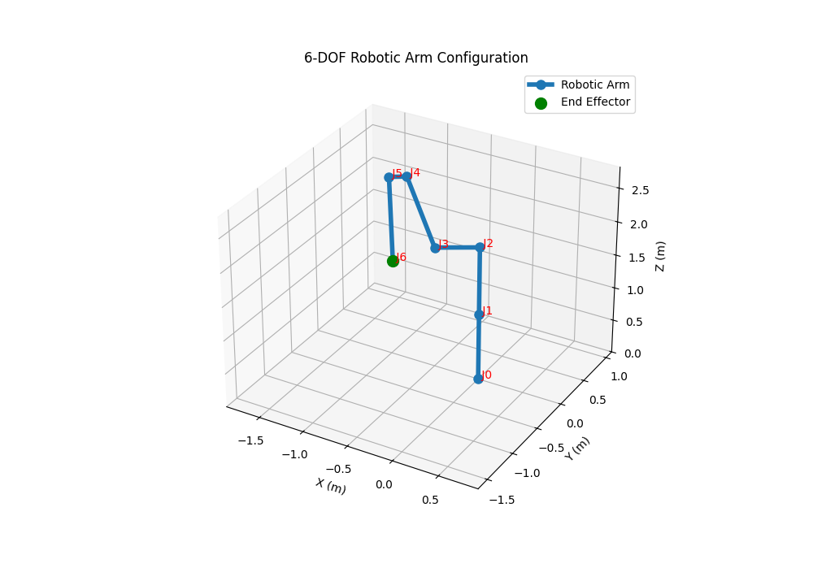

# Lab 3 — Geometric Jacobian of a 6-DOF Robotic Manipulator via Symbolic Differentiation


 

> **Course:** Robot Modeling and Identification (RMI) <br>
> **Author:** Umer Ahmed Baig Mughal — MSc Robotics and Artificial Intelligence <br>
> **Topic:** Geometric Jacobian · Symbolic Differentiation · Velocity Kinematics · Manipulability · 3D Configuration Visualization

---

## Table of Contents

1. [Objective](#objective)
2. [Theoretical Background](#theoretical-background)
   - [The Jacobian Matrix in Robotics](#the-jacobian-matrix-in-robotics)
   - [Geometric Jacobian — Column Structure](#geometric-jacobian--column-structure)
   - [Linear Velocity Columns — Analytic Differentiation](#linear-velocity-columns--analytic-differentiation)
   - [Angular Velocity Columns — Z-Axis Propagation](#angular-velocity-columns--z-axis-propagation)
   - [Jacobian Properties — Rank, Singularity, Manipulability](#jacobian-properties--rank-singularity-manipulability)
   - [Symbolic vs. Numerical Jacobian Methods](#symbolic-vs-numerical-jacobian-methods)
3. [Robot Configuration](#robot-configuration)
   - [DH Parameter Table](#dh-parameter-table)
   - [Changes from Labs 1 and 2](#changes-from-labs-1-and-2)
4. [Implementation](#implementation)
   - [File Structure](#file-structure)
   - [Function Reference](#function-reference)
   - [Algorithm Walkthrough](#algorithm-walkthrough)
5. [3D Visualiation](#3d-visualization)
   - [How the Visualization Works](#how-the-visualization-works)
   - [Interpreting the Plot](#interpreting-the-plot)
6. [How to Run](#how-to-run)
7. [Results](#results)
   - [Computed Jacobian Matrix](#computed-jacobian-matrix)
   - [Column-by-Column Interpretation](#column-by-column-interpretation)
   - [Jacobian Properties at the Test Configuration](#jacobian-properties-at-the-test-configuration)
8. [Dependencies](#dependencies)
9. [Notes and Limitations](#notes-and-limitations)
10. [Author](#author)
11. [License](#license)

---

## Objective

This lab computes the **geometric Jacobian matrix** of a six-degree-of-freedom (6-DOF) serial robotic manipulator using **symbolic differentiation** via the SymPy computer algebra system. The Jacobian is the fundamental linear map relating joint-space velocities to end-effector Cartesian velocities — a quantity central to velocity kinematics, force control, singularity analysis, and motion planning.

Rather than relying on finite-difference approximations or the geometric cross-product formulation, Lab 3 derives the **linear velocity sub-Jacobian analytically** by taking exact closed-form partial derivatives of the end-effector position expression with respect to each joint angle. The angular sub-Jacobian is assembled from the z-axes of successive coordinate frames, following the standard revolute-joint formula. The fully assembled 6×6 numeric Jacobian is then evaluated at a specified joint configuration.

The key learning outcomes are:

- Understanding the Jacobian as a velocity-level linearisation of the forward kinematics map.
- Constructing the full kinematic chain symbolically using DH transformation matrices.
- Deriving the linear Jacobian columns via exact symbolic partial differentiation.
- Assembling the angular Jacobian columns from the propagated z-axes of frame transformations.
- Evaluating the symbolic Jacobian numerically at a given joint configuration.
- Interpreting Jacobian properties: rank, determinant, condition number, and manipulability index.
- Recognising physically meaningful structural patterns in the Jacobian matrix.

---

## Theoretical Background

### The Jacobian Matrix in Robotics

The Jacobian **J(q)** is a 6×n matrix (n = number of joints) that linearly maps joint velocities **q̇** to end-effector spatial velocities **ξ̇**:

```
ξ̇ = J(q) · q̇

┌ ẋ  ┐   ┌ Jv₁  Jv₂  Jv₃  Jv₄  Jv₅  Jv₆ ┐   ┌ q̇₁ ┐
│ ẏ  │   │                              │   │ q̇₂ │
│ ż  │ = │                              │ · │ q̇₃ │
│ ωx │   │ Jw₁  Jw₂  Jw₃  Jw₄  Jw₅  Jw₆ │   │ q̇₄ │
│ ωy │   │                              │   │ q̇₅ │
└ ωz ┘   └                              ┘   └ q̇₆ ┘
```

The top three rows map to **linear velocity** (ẋ, ẏ, ż) of the end-effector; the bottom three rows map to **angular velocity** (ωx, ωy, ωz). Each column corresponds to the contribution of one joint's velocity.

---

### Geometric Jacobian — Column Structure

For a **revolute joint** *i*, the *i*-th column of the geometric Jacobian is:

```
        ┌  Jvᵢ  ┐   ┌  ∂p₀₆ / ∂qᵢ  ┐
Jᵢ  =   │       │ = │              │
        └  Jwᵢ  ┘   └    zᵢ₋₁      ┘
```

where:
- **Jvᵢ = ∂p₀₆/∂qᵢ** — exact partial derivative of the end-effector position vector with respect to joint angle *i*
- **Jwᵢ = zᵢ₋₁** — the unit z-axis of frame *i−1* (the rotation axis of joint *i*)

The angular columns are taken from the z-axis of the **preceding** frame, not the current joint's own frame. For the base frame (joint 1), the z-axis is always `[0, 0, 1]ᵀ`.

---

### Linear Velocity Columns — Analytic Differentiation

Lab 3 computes the linear Jacobian rows by **exact symbolic differentiation** of the end-effector position vector `p₀₆` with respect to each joint angle, using SymPy:

```python
Jv_i = sp.diff(p06, qi)    # exact closed-form partial derivative
```

This is equivalent to the geometric cross-product formula `zᵢ₋₁ × (p₀₆ − pᵢ₋₁)` for revolute joints, but derived algebraically rather than geometrically. Both approaches yield the same result; the analytic approach is more general and numerically exact.

---

### Angular Velocity Columns — Z-Axis Propagation

The angular Jacobian column for joint *i* is the z-axis of the coordinate frame **preceding** joint *i*, extracted from the third column of the cumulative transformation matrix:

```
Jw₁ = z₀  =  T₀₀[0:3, 2]  =  [0, 0, 1]ᵀ           (base frame)
Jw₂ = z₁  =  T₀₁[0:3, 2]
Jw₃ = z₂  =  T₀₂[0:3, 2]  =  T₀₁·T₁₂[0:3, 2]
Jw₄ = z₃  =  T₀₃[0:3, 2]
Jw₅ = z₄  =  T₀₄[0:3, 2]
Jw₆ = z₅  =  T₀₅[0:3, 2]
```

Note that `z₀` and the z-columns of T₀₁ through T₀₅ are all evaluated **symbolically**, then substituted with numerical joint angles simultaneously at the final evaluation step.

---

### Jacobian Properties — Rank, Singularity, Manipulability

| Property | Definition | Value at test config |
|----------|------------|:-------------------:|
| **Rank** | Number of linearly independent columns | **6** (full rank) |
| **Determinant** | `det(J)` — zero implies singularity | **0.2898** |
| **Condition number** | `σ_max / σ_min` — sensitivity to numerical error | **13.18** |
| **Manipulability index** | `w = √det(J·Jᵀ)` — volume of velocity ellipsoid | **0.2898** |
| **Singular values** | `[2.427, 1.575, 1.387, 0.585, 0.507, 0.184]` | Well-conditioned |

The **manipulability index** `w = √det(J·Jᵀ)` measures how far the robot is from a kinematic singularity. At `w = 0.2898`, the robot is in a non-singular configuration with moderate dexterity — it can generate end-effector velocities in all six directions, but not with equal ease in all directions (as reflected by the spread in singular values from 0.184 to 2.427).

---

### Symbolic vs. Numerical Jacobian Methods

| Aspect | Analytic (SymPy) — Lab 3 | Numerical (Finite Difference) |
|--------|--------------------------|-------------------------------|
| Accuracy | Exact — machine precision | Approximate — step-size dependent |
| Computation cost | Slow (symbolic engine) | Fast |
| Singularity detection | Exact | May miss near-singular cases |
| Generalisation | Valid for any configuration | Valid for any configuration |
| Use case | Education, verification | Real-time control |

---

## Robot Configuration

### DH Parameter Table

| Joint | θᵢ (variable, rad) | dᵢ (m) | aᵢ (m) | αᵢ (rad) |
|:-----:|:-------------------:|:-------:|:-------:|:--------:|
|   1   | q₁                  | 1       | 0       | +π/2     |
|   2   | q₂                  | 0       | **1**   |  0       |
|   3   | q₃ + **π/2**        | 0       | **0.5** | +π/2     |
|   4   | q₄                  | 1       | 0       | **+π/2** |
|   5   | q₅                  | **0.2** | 0       | +π/2     |
|   6   | q₆                  | 1       | 0       |  0       |

The +π/2 offset is applied to q₃ inside the `visualize_robot` FK pass (consistent with Labs 1 and 2), but **not** inside the symbolic Jacobian computation. In the Jacobian, q₃ enters as a pure symbolic variable; the offset does not appear because the Jacobian is computing the velocity sensitivity of the kinematic chain as parameterised — it does not need to reproduce a specific zero-configuration.

### Changes from Labs 1 and 2

Three DH parameters differ from the robot used in Labs 1 and 2, making this a **distinct manipulator configuration**:

| Parameter | Labs 1 & 2 | Lab 3 | Physical consequence |
|-----------|:----------:|:-----:|----------------------|
| `a[2]` (link 3 length) | 0 | **0.5 m** | Link 3 now has non-zero length → **J2 and J3 are no longer coincident** |
| `d[4]` (joint 5 offset) | 0 | **0.2 m** | Joint 5 has a non-zero offset → **J4 and J5 are no longer coincident** |
| `alpha[3]` (joint 4 twist) | −π/2 | **+π/2** | Sign reversal of wrist twist → different wrist bending geometry |

The consequence is significant for visualization: **all 7 joint frame origins are geometrically distinct** in Lab 3, so the 3D plot shows **7 visible markers** — as opposed to the 5 visible markers in Labs 1 and 2 where two pairs of joints were coincident.

---

## Implementation

### File Structure

```
Lab_3/
├── RMI_Task_3.py          # Symbolic Jacobian computation + 3D visualization
└── Results/
    └── lab3_robot.png     # Output plot for the test configuration
```

### Function Reference

#### `transformation_matrix(q, a, d, alpha) → sp.Matrix`

Constructs the **4×4 homogeneous DH transformation matrix** as a **SymPy symbolic matrix**. Unlike `compute_transformation` (which works numerically), this function keeps `q` as a symbolic variable, enabling downstream symbolic differentiation.

| Argument | Type       | Description                                     |
|----------|------------|-------------------------------------------------|
| `q`      | `sp.Symbol`| Symbolic joint angle variable                   |
| `a`      | `float`    | Link length (m)                                 |
| `d`      | `float`    | Link offset (m)                                 |
| `alpha`  | `sp.Expr`  | Twist angle — may be a SymPy expression (`sp.pi/2`) |

**Returns:** `sp.Matrix` of shape `(4, 4)` — symbolic transformation matrix with trigonometric expressions in `q`.

---

#### `jacobian(q) → np.ndarray`

Computes the **6×6 geometric Jacobian matrix** of the manipulator at the joint configuration `q` using exact symbolic differentiation.

| Argument | Type          | Description                                            |
|----------|---------------|--------------------------------------------------------|
| `q`      | `list[float]` | Six joint angles in radians: `[q₁, q₂, q₃, q₄, q₅, q₆]` |

**Returns:** `np.ndarray` of shape `(6, 6)` — the numeric Jacobian matrix evaluated at `q`.

**Internal pipeline:**
1. Declare six SymPy symbolic variables `q1 … q6`.
2. Build all six individual DH transformation matrices symbolically.
3. Compute cumulative transformations T₀₁ through T₀₆ by matrix multiplication.
4. Extract the end-effector position vector `p₀₆ = T₀₆[0:3, 3]` (symbolic).
5. Extract z-axis vectors `z₀ … z₅` from the third column of each cumulative frame.
6. Differentiate `p₀₆` symbolically with respect to each `qᵢ` to get the linear Jacobian columns.
7. Stack each `[∂p₀₆/∂qᵢ; zᵢ₋₁]` pair into a 6×1 column.
8. Horizontally concatenate all six columns into the 6×6 Jacobian.
9. Substitute numerical values via `.subs()` and convert to NumPy via `.astype(np.float64)`.

---

#### `compute_transformation(theta, d, a, alpha) → np.ndarray`

Numerical DH transformation matrix used exclusively in the **visualization forward kinematics** pass. Identical in structure to the symbolic `transformation_matrix` but operates on standard Python floats via NumPy.

| Argument | Type    | Description                    |
|----------|---------|--------------------------------|
| `theta`  | `float` | Joint angle in radians         |
| `d`      | `float` | Link offset (m)                |
| `a`      | `float` | Link length (m)                |
| `alpha`  | `float` | Twist angle in radians         |

**Returns:** `np.ndarray` of shape `(4, 4)`.

---

#### `visualize_robot(q) → None`

Renders the 3D configuration of the manipulator at the given joint angles. Structurally identical to Lab 2's `visualize_robot`, using the same enhanced styling (thick arm, green end-effector, red joint labels, equal aspect ratio). The DH parameters used internally match those in `jacobian()`.

| Argument | Type          | Description                          |
|----------|---------------|--------------------------------------|
| `q`      | `list[float]` | Six joint angles in radians          |

**Returns:** `None` — opens an interactive 3D Matplotlib window.

---

### Algorithm Walkthrough

```python
# ── STAGE 1: Symbolic Setup ───────────────────────────────────────────────

# Step 1 — Declare symbolic joint angle variables
q1, q2, q3, q4, q5, q6 = sp.symbols('q1 q2 q3 q4 q5 q6')

# Step 2 — Build symbolic DH matrices per joint
T01 = transformation_matrix(q1, a[0], d[0], alpha[0])  # entries contain cos(q1), sin(q1)
T12 = transformation_matrix(q2, a[1], d[1], alpha[1])  # ... cos(q2), sin(q2) etc.
# ... T23 through T56

# Step 3 — Compose cumulative symbolic transformations
T02 = T01 * T12     # SymPy matrix multiplication — result is symbolic
T03 = T02 * T23
T04 = T03 * T34
T05 = T04 * T45
T06 = T05 * T56     # T06 is a 4x4 symbolic matrix with cos/sin of all q_i

# ── STAGE 2: Jacobian Assembly ────────────────────────────────────────────

# Step 4 — Extract end-effector position (symbolic 3x1 vector)
p06 = T06[0:3, 3]   # each entry is a trigonometric polynomial in q1..q6

# Step 5 — Extract z-axes (rotation axes for angular Jacobian columns)
z0 = T00[0:3, 2]    # = [0, 0, 1]  (base frame z-axis, constant)
z1 = T01[0:3, 2]    # = symbolic function of q1
z2 = T02[0:3, 2]    # = symbolic function of q1, q2
# ...
z5 = T05[0:3, 2]    # = symbolic function of q1..q5

# Step 6 — Form each Jacobian column: [linear; angular]
j1 = sp.Matrix.vstack(sp.diff(p06, q1), z0)  # linear = dp06/dq1, angular = z0
j2 = sp.Matrix.vstack(sp.diff(p06, q2), z1)  # linear = dp06/dq2, angular = z1
# ... j3 through j6

# Step 7 — Assemble full 6x6 Jacobian
J = sp.Matrix.hstack(j1, j2, j3, j4, j5, j6)  # shape: (6, 6) symbolic

# ── STAGE 3: Numerical Evaluation ─────────────────────────────────────────

# Step 8 — Substitute numerical joint angles
J_numeric = J.subs({q1: 0.1, q2: pi/2, q3: 0.3, q4: pi/2, q5: 0.5, q6: 0.6})

# Step 9 — Convert to NumPy array
j_numeric = np.array(J_numeric).astype(np.float64)
```

---

## 3D Visualization

### How the Visualization Works

`visualize_robot(q)` runs a separate **purely numerical forward kinematics** pass — independent from the symbolic Jacobian computation — to find the 3D position of every joint frame origin. The `thetas` vector applies the +π/2 offset to q₃ for frame alignment:

```python
thetas = [q[0], q[1], q[2] + np.pi/2, q[3], q[4], q[5]]
```

### Interpreting the Plot

| Visual Element | Meaning |
|----------------|---------|
| **Blue line** | Robot arm skeleton connecting consecutive joint origins |
| **Blue circular markers `●`** | Joint frame origins — **all 7 are distinct** in Lab 3 |
| **Red text labels J0–J6** | Joint index annotations at each frame origin |
| **Green filled circle `●`** | End-effector position, uniquely highlighted at J6 |
| **Axes X(m), Y(m), Z(m)** | Base coordinate frame with explicit unit labels |
| **Equal aspect ratio** | All three axes scaled identically for geometric accuracy |

**Computed positions of all 7 joint frame origins:**

| Label | X (m) | Y (m) | Z (m) | Segment length |
|:-----:|:-----:|:-----:|:-----:|:--------------:|
| J0 (Base) | 0.0000 | 0.0000 | 0.0000 | — |
| J1 | 0.0000 | 0.0000 | 1.0000 | 1.000 m (d₁) |
| J2 | 0.0000 | 0.0000 | 2.0000 | 1.000 m (a₂) |
| J3 | −0.4753 | −0.0477 | 1.8522 | 0.500 m (a₃) |
| J4 | −0.7693 | −0.0772 | 2.8076 | 1.000 m (d₄) |
| J5 | −0.9594 | −0.0963 | 2.7485 | 0.200 m (d₅) |
| J6 (End-Effector) | **−0.6535** | **−0.5474** | **1.9101** | 1.000 m (d₆) |

> Unlike Labs 1 and 2, **all 7 markers are geometrically distinct**. This is because `a₃ = 0.5 m` (non-zero link 3 length) separates J2 from J3, and `d₅ = 0.2 m` (non-zero joint 5 offset) separates J4 from J5.

### Example Output



---

## How to Run

### Clone the repository and navigate to the lab directory

```bash
git clone https://github.com/umerahmedbaig7/Robot-Modeling-and-Identification.git
cd Robot-Modeling-and-Identification/Lab3
```

### Prerequisites

```bash
pip install numpy sympy matplotlib
```

> ⚠️ **Note on runtime:** The SymPy symbolic computation involves differentiating a large trigonometric polynomial (the full 6-joint forward kinematics expression) with respect to each of six variables. This is computationally expensive compared to a purely numerical approach. Expect the `jacobian()` call to take **several seconds** to complete on a standard CPU.

### Running the Script

```bash
python RMI_Task_3.py
```

The script will:
1. Compute the symbolic Jacobian and evaluate it numerically.
2. Print the full 6×6 Jacobian matrix to the terminal.
3. Open an interactive 3D Matplotlib window showing the arm configuration.

### Modifying the Joint Angles

Edit the `q_values` list to evaluate the Jacobian and visualization at a different configuration (values in **radians**):

```python
q_values = [0.1, np.pi/2, 0.3, np.pi/2, 0.5, 0.6]
```

### Changing the Robot Geometry

The DH parameters are defined **twice** in the script — once in `jacobian()` (symbolic, as Python lists) and once in `visualize_robot()` (numerical, as NumPy arrays). Both must be kept **identical** for the Jacobian and the visualization to correspond to the same robot:

```python
# In jacobian() — symbolic context
a = [0, 1, 0.5, 0, 0, 0]
d = [1, 0, 0, 1, 0.2, 1]
alpha = [sp.pi/2, 0, sp.pi/2, sp.pi/2, sp.pi/2, 0]

# In visualize_robot() — numeric context
a = [0, 1, 0.5, 0, 0, 0]
d = [1, 0, 0, 1, 0.2, 1]
alpha = [np.pi/2, 0, np.pi/2, np.pi/2, np.pi/2, 0]
```

---

## Results

### Computed Jacobian Matrix

For `q = [0.1, π/2, 0.3, π/2, 0.5, 0.6]` rad:

```
Jacobian Matrix J(q):

       q₁          q₂         q₃         q₄        q₅          q₆
  ┌                                                                  ┐
ẋ │  0.48601   -1.69639   -0.70139    0.16094    0.54334    0.00000  │
ẏ │ -0.04160   -0.17021   -0.07037   -0.18486   -0.82747    0.00000  │
ż │  0.00000   -0.08991   -0.08991   -0.45801    0.14168    0.00000  │
ωx│  0.00000    0.09983    0.09983    0.95056   -0.29404   -0.78634  │
ωy│  0.00000   -0.99500   -0.99500    0.09537   -0.02950   -0.56073  │
ωz│  1.00000    0.00000    0.00000    0.29552    0.95534   -0.25934  │
  └                                                                  ┘
```

### Column-by-Column Interpretation

| Column | Joint | Linear Jvᵢ | Angular Jwᵢ | Physical interpretation |
|:------:|:-----:|:----------:|:-----------:|-------------------------|
| 1 | q₁ (base) | `[0.486, −0.042, 0]` | `[0, 0, 1]` | Base rotation sweeps EE in XY plane; z-velocity = 0 (horizontal rotation axis) |
| 2 | q₂ (shoulder) | `[−1.696, −0.170, −0.090]` | `[0.100, −0.995, 0]` | Largest linear influence — shoulder has maximum mechanical advantage |
| 3 | q₃ (elbow) | `[−0.701, −0.070, −0.090]` | `[0.100, −0.995, 0]` | Columns 2 and 3 share the same angular row (z₁=z₂) — joints 2 and 3 are parallel-axis |
| 4 | q₄ | `[0.161, −0.185, −0.458]` | `[0.951, 0.095, 0.296]` | Wrist joint with significant Z-velocity coupling |
| 5 | q₅ | `[0.543, −0.827, 0.142]` | `[−0.294, −0.030, 0.955]` | Largest angular z-component — strong yaw authority |
| 6 | q₆ | **`[0, 0, 0]`** | `[−0.786, −0.561, −0.259]` | **Zero linear velocity** — last joint only spins the wrist, translates nothing |

> **Notable pattern — Column 6 linear part = [0, 0, 0]:** Joint 6 has `a₆ = 0` and `d₆` merely shifts the tool frame along its own z-axis. Rotating q₆ produces **no change in end-effector position** — only a change in orientation. This is physically correct and expected for any wrist-spin joint where the rotation axis passes through the end-effector origin.

> **Notable pattern — Columns 2 & 3 share the same angular row:** The z-axis of frame 1 (`z₁`) equals the z-axis of frame 2 (`z₂`) for this robot configuration at `q = [0.1, π/2, …]`. This means joints 2 and 3 have **parallel rotation axes** at this configuration, contributing identical angular velocity directions. This is not a singularity — the linear rows are still independent.

### Jacobian Properties at the Test Configuration

| Property | Value | Interpretation |
|----------|:-----:|----------------|
| Shape | 6×6 | Square — 6 joints, 6 DOF |
| Rank | **6** | Full rank — non-singular configuration |
| Determinant | **0.2898** | Non-zero — all motions are achievable |
| Condition number | **13.18** | Moderate — some directional anisotropy |
| Manipulability index | **0.2898** | Healthy distance from singularity |
| Singular values | `[2.427, 1.575, 1.387, 0.585, 0.507, 0.184]` | Spread ~13× — velocity ellipsoid is elongated |

---

## Dependencies

| Package | Version | Purpose |
|---------|---------|---------|
| `Python` | ≥ 3.8 | Runtime environment |
| `NumPy` | ≥ 1.21 | Numerical matrix operations, visualization FK |
| `SymPy` | ≥ 1.9 | Symbolic DH matrices, exact partial differentiation |
| `Matplotlib` | ≥ 3.4 | 3D arm configuration visualization (`mpl_toolkits.mplot3d`) |

All packages are available via pip and are standard in any scientific Python distribution (Anaconda, conda-forge, etc.).

---

## Notes and Limitations

- **Dual DH definition:** The DH parameters are defined independently inside `jacobian()` (using `sp.pi`) and `visualize_robot()` (using `np.pi`). If the robot geometry is changed, **both definitions must be updated in sync**. A refactored version would define them once as a shared configuration object.
- **q₃ offset convention:** The +π/2 offset on q₃ is applied in `visualize_robot()` via `thetas = [..., q[2]+np.pi/2, ...]` but is **not** present in the symbolic `jacobian()` computation. The Jacobian is derived with respect to the raw joint variable q₃. Users requiring the Jacobian in the offset parameterisation would need to pre-add π/2 to the q₃ input value.
- **SymPy performance:** Symbolic computation scales poorly with kinematic complexity. For a 6-DOF chain with trigonometric DH matrices, each `sp.diff(p06, qi)` involves differentiating a large composed expression. The function may take 5–30 seconds depending on hardware. For real-time applications, the symbolic Jacobian should be pre-computed once and exported as a numerical function using `sp.lambdify`.
- **Configuration dependency:** The Jacobian is configuration-dependent — the matrix `J(q)` is unique to the supplied joint angles. All properties (rank, determinant, manipulability) must be re-evaluated whenever `q` changes.
- **Singularity detection:** A determinant of zero indicates a kinematic singularity where the robot loses one or more DOF. The current implementation computes the Jacobian but does not explicitly check for or report singularity proximity. Adding a `det(J)` threshold check is recommended before using this Jacobian in a control loop.
- **All 7 joints are geometrically distinct:** Due to `a₃ = 0.5 m` and `d₅ = 0.2 m`, none of the joint frame origins coincide — unlike Labs 1 and 2 where two pairs were overlapping. The 3D plot consequently shows 7 distinct markers.

---

## Author

**Umer Ahmed Baig Mughal** <br>
Master's in Robotics and Artificial Intelligence <br>
*Specialization: Machine Learning · Computer Vision · Human-Robot Interaction · Autonomous Systems · Robotic Motion Control*

---

## License

This project is intended for **academic and research use**. It was developed as part of the *Robot Modeling and Identification* course within the MSc Robotics and Artificial Intelligence program. Redistribution, modification, and use in derivative academic work are permitted with appropriate attribution to the original author.

---

*Lab 3 — Robot Modeling and Identification | MSc Robotics and Artificial Intelligence*

